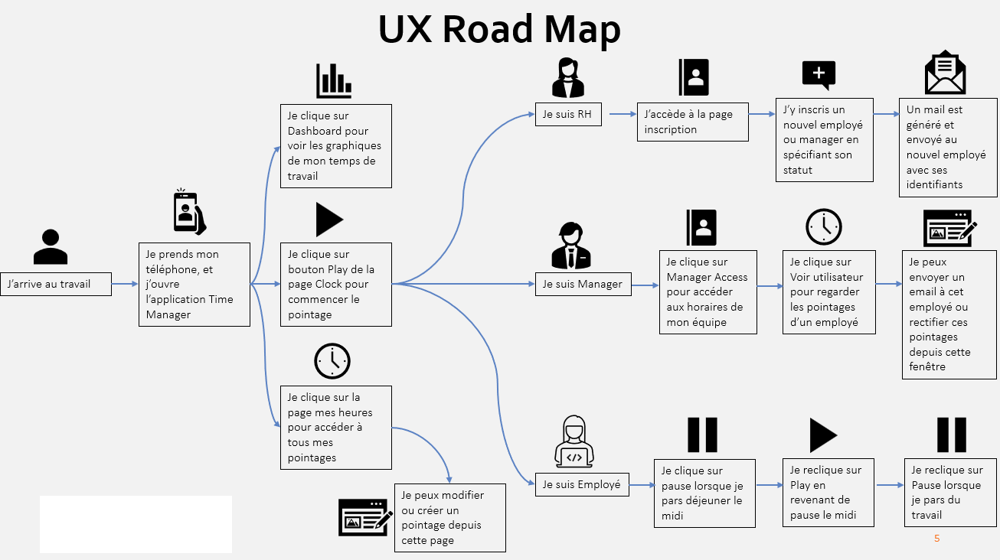

# Mini-Project #2 - Design Thinking (Design UX/UI, Change Management)

**Objectif :** Accompagner la transition des entreprises vers l'outil Time Manager à tous les niveaux hiérarchiques

**Contraintes :** Prise en compte du retour des employés par mail 

## Introduction

**Après avoir analysé les mails envoyés, nous en avons déduit 5 personaes :**
- l'employé entre 50 et 60 ans qui n'aime pas le changement et la technologie.
- L'ouvrier qui fait un travail physique et fatiguant qui ne veut pas être surveillé.
- La personne ayant un handicap qui a des difficultés à utiliser l'application.
- Le manageur très ambitieux et autocentré qui veut avoir dû contrôle sur son équipe.
- Le manageur à l'écoute de son équipe qui veut être en bonne entente avec chacun de ses collègues. 

Ces personaes nous ont aidé à envisager des solutions pour une meilleure prise en main de l'outil et une meilleure acceptation du changement.

## Design UX/UI

En faisant une road map UX, nous avons pu convenir des différents rôles nécessaire au bon fonctionnement de Time Manager :
- Les manageurs
- Les responsables des ressources humaines
- Les employés

